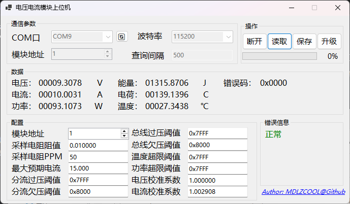

# 电压电流模块（全隔离版）

## 简介

采用ina229前端+cs32l010f8u6单片机做的信号供电全隔离的电压电流模组，采用串口MODBUS输出，支持0-85V电压测量。

至于为什么是cs32l010f8u6，最近偶然得到几百片这个mcu，想办法用掉吧~

## 使用须知

- 支持测量的电压范围是0-85V
- 支持测量的最大电流与采样电阻有关，计算公式为`I_MAX ≤ 0.16384 / R_SHUNT`，其中R_SHUNT单位为欧姆，I单位安培
- 用户需要同时接入3.3V和5V电平，其中丝印3.3V的位置可以接入其他电平，作为串口RXTX的输出电平，5V位置只能接入5V
- “全隔离”指信号与供电全隔离，如果用户供电或信号的地与被测电流电压信号的地导通，则不隔离，但是仍可正常使用

## 上位机

- 上位机可以用于更改模块MODBUS地址、采样电阻信息、最大预期电流、校准系数
- 需要注意的是，最大预期电流公式见“使用须知”，并不是无限大的
- 所以用户更改采样电阻以适配不同精度，不同量程后，需要手动更新采样电阻信息，也可能需要重新设置校准系数
- 校准系数 = 实测值 ÷ 上位机显示值
- 上位机可以直接进行固件升级，连接好后，点击“升级”，选择新的bin文件即可进行升级，升级不会导致配置信息丢失。如果升级失败，可以“按住按键”并重新上电后重试

## Modbus 寄存器表

### 通信参数

| 项目                   | 值                                                           |
| ---------------------- | ------------------------------------------------------------ |
| 物理接口               | 串口（UART，隔离输出）                                       |
| 协议                   | Modbus RTU                                                   |
| 波特率                 | 115200 bps                                                   |
| 数据位 / 校验 / 停止位 | 8 / None / 1                                                 |
| 从机地址               | 可配置，默认 1                                               |
| 实现的功能码           | `0x03` 读保持寄存器、`0x06` 写单个寄存器、`0x10` 写多个寄存器 |

### 数据格式说明

- 浮点数（float）：IEEE-754 单精度，占用 2 个连续寄存器高位字在前（Big-Endian）。即地址 N 存高 16 位、地址 N+1 存低 16 位，每个寄存器内部字节大端。
- 整型（uint16）：占用 1 个寄存器，大端。
- 测量数据区为只读（RO），用于获取测量数据。
- 配置参数区为可读写（RW）：修改后先存于 RAM，需向 `0x0110` 写入保存指令才会写入 Flash。

### 保持寄存器 — 测量数据（只读）

| 地址(hex) | 地址(dec) | 寄存器范围    | 名称                 | 类型(寄存器数) | 单位 | 说明                            |
| --------- | --------- | ------------- | -------------------- | -------------- | ---- | ------------------------------- |
| 0x0000    | 0         | 0x0000–0x0001 | Voltage（电压）      | float (2)      | V    | 总线电压                        |
| 0x0002    | 2         | 0x0002–0x0003 | Current（电流）      | float (2)      | A    | 电流                            |
| 0x0004    | 4         | 0x0004–0x0005 | Power（功率）        | float (2)      | W    | 功率                            |
| 0x0006    | 6         | 0x0006–0x0007 | Charge（电荷量）     | float (2)      | C    | 累计电荷量                      |
| 0x0008    | 8         | 0x0008–0x0009 | Temperature（温度）  | float (2)      | °C   | 内部温度                        |
| 0x000A    | 10        | 0x000A–0x000B | Energy（能量）       | float (2)      | J    | 累计能量，1 Wh = 3600 J         |
| 0x000C    | 12        | 0x000C        | Error Code（错误码） | uint16 (1)     | —    | INA229 诊断/告警位域，见第 5 节 |

### 保持寄存器 — 配置参数（可读写）

| 地址(hex) | 地址(dec) | 寄存器范围    | 名称       | 类型(寄存器数) | 单位   | 默认值 | 说明                                                   |
| --------- | --------- | ------------- | ---------- | -------------- | ------ | ------ | ------------------------------------------------------ |
| 0x0100    | 256       | 0x0100        | ModbusAddr | uint16 (1)     | —      | 1      | 本机 Modbus 从机地址                                   |
| 0x0101    | 257       | 0x0101–0x0102 | RshuntOhm  | float (2)      | Ω      | 0.01   | 采样电阻值 R_SHUNT；修改后需用 0x0103 配合标定为新量程 |
| 0x0103    | 259       | 0x0103–0x0104 | IexpMax    | float (2)      | A      | 15.0   | 最大预期电流 I_MAX；约束：`I_MAX ≤ 0.16384 / R_SHUNT`  |
| 0x0105    | 261       | 0x0105        | ShuntOVTｈ | uint16 (1)     | —      | 0x7FFF | 分流过压阈值（SOVL）                                   |
| 0x0106    | 262       | 0x0106        | ShuntUVTh  | uint16 (1)     | —      | 0x8000 | 分流欠压阈值（SUVL）                                   |
| 0x0107    | 263       | 0x0107        | BusOVTｈ   | uint16 (1)     | —      | 0x7FFF | 总线过压阈值（BOVL）                                   |
| 0x0108    | 264       | 0x0108        | BusUVTh    | uint16 (1)     | —      | 0x8000 | 总线欠压阈值（BUVL）                                   |
| 0x0109    | 265       | 0x0109        | TempOLTh   | uint16 (1)     | —      | 0x7FFF | 温度超限阈值（TEMP_LIMIT）                             |
| 0x010A    | 266       | 0x010A        | PowerOLTh  | uint16 (1)     | —      | 0x7FFF | 功率超限阈值（PWR_LIMIT）                              |
| 0x010B    | 267       | 0x010B–0x010C | VoltageK   | float (2)      | —      | 1.0    | 电压校准系数 = `实测值 ÷ 显示值`                       |
| 0x010D    | 269       | 0x010D–0x010E | CurrentK   | float (2)      | —      | 1.0    | 电流校准系数 = `实测值 ÷ 显示值`                       |
| 0x010F    | 271       | 0x010F        | RshuntPPM  | uint16 (1)     | ppm/°C | 50     | 采样电阻温度系数                                       |
| 0x0110    | 272       | 0x0110        | SaveCmd    | uint16 (1)     | —      | 0      | 写命令：写入 `0x4B56` 将当前配置保存到 Flash           |
| 0x0111    | 273       | 0x0111        | BootCmd    | uint16 (1)     | —      | 0      | 写命令：写入 `0x4B4F` 重启进入固件升级模式             |

### 错误码（Error Code，0x000C）位定义

| Bit  | 宏 / 名称 | 含义           |
| ---- | --------- | -------------- |
| 0    | MEMSTAT   | 存储器校验错误 |
| 1    | CNVRF     | 转换完成标志   |
| 2    | POL       | 功率超限       |
| 3    | BUSUL     | 总线欠压       |
| 4    | BUSOL     | 总线过压       |
| 5    | SHNTUL    | 分流欠压       |
| 6    | SHNTOL    | 分流过压       |
| 7    | TMPOL     | 温度超限       |
| 8    | OFFLINE   | 芯片离线       |
| 9    | MATHOF    | 数学计算溢出   |
| 10   | CHARGEOF  | 电荷寄存器溢出 |
| 11   | ENERGYOF  | 能量寄存器溢出 |

### 使用要点

- 读实时数据：用功能码 `0x03` 读取 0x0000–0x000C。
- 改配置并保存：先写 0x0100–0x010F 中目标寄存器，再向 0x0110 写 `0x4B56` 保存。
- 固件升级：向 0x0111 写 `0x4B4F` 进入升级模式，再用 YMODEM 方式烧录新 bin。
- 校准：`校准系数 = 实测值 ÷ 上位机显示值`，写入电压电流校准系数后保存。
- 量程约束：更换采样电阻后需重设采样电阻信息与最大预期电流，并满足 `I_MAX ≤ 0.16384 / R_SHUNT`，必要时重新校准系数。

## 目录结构

- [./Hardware](Hardware)下为硬件设计，使用Kicad 8.0以上版本打开
- [./Firmware](Firmware)下为编译好的固件
- [./Software](Software)下为mcu源码
- [./Upper](Upper)下为上位机源码
- [./Document](Document)下为mcu的ds和pack

## Changelog

20260713更新：初始化仓库。硬件完成，软件还没写，已送去jlc打样pcb+smt。。希望这个究极灵车mcu不要翻车了

20260801更新：V1.0，完成上位机，上位机实现了数据测量、参数修改、固件更新。完成下位机Application+Bootloader，实现modbus通信，传感器读取，参数保存，固件更新。

